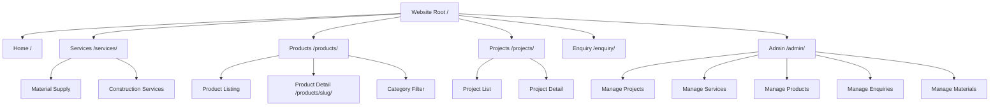
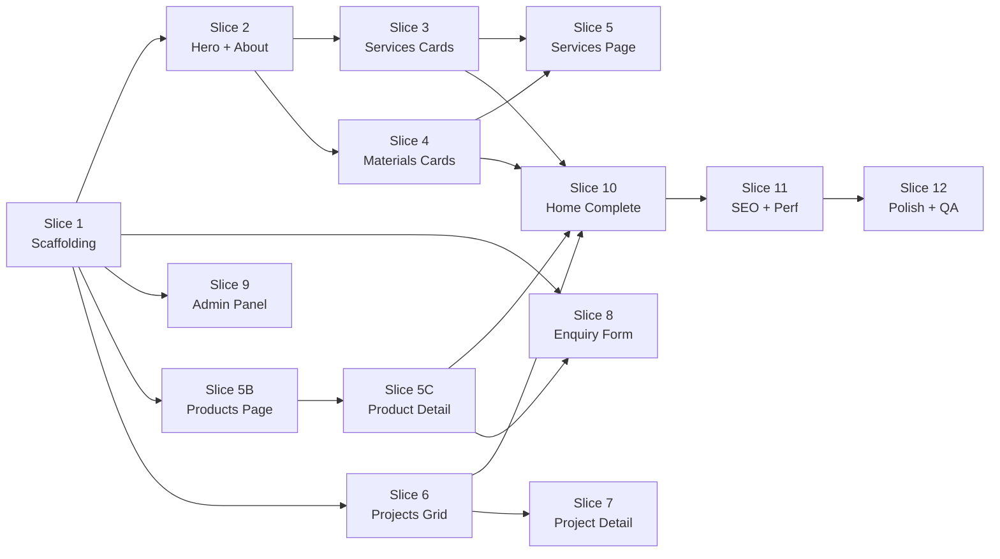

# Viruksha Enterprises — Product Requirements Document (PRD)

## 1. Executive Summary

Viruksha Enterprises requires a professional corporate website to establish its digital presence in the construction industry. The site will showcase two core business divisions — **Construction Material Supply** and **Construction Services** — along with a **Product Catalog** that displays the company's product range in an e-commerce-style browsing experience (view-only, no cart or ordering). The website drives customer enquiries and builds brand credibility.

**Tech Stack:** HTML · CSS · JavaScript (Frontend) → Django · SQLite (Backend)

---

## 2. Target Audience

| Segment | Need |
|---|---|
| Contractors & Builders | Reliable material supply, subcontracting services |
| Architects & Engineers | Quality materials specs, project collaboration |
| Industrial / Manufacturing Clients | Bulk material procurement |
| Business Owners & Homeowners | End-to-end construction services |

---

## 3. Information Architecture



---

## 4. Data Models

### 4.1 `Service`
| Field | Type | Notes |
|---|---|---|
| id | AutoField | PK |
| title | CharField(200) | e.g. "Residential Construction" |
| category | CharField — choices: `MATERIAL`, `CONSTRUCTION` | Business division |
| slug | SlugField | URL-friendly identifier |
| short_description | CharField(300) | Card summary |
| full_description | TextField | Detail page content |
| icon_class | CharField(100) | CSS icon class or SVG reference |
| image | ImageField | Hero/banner image |
| is_featured | BooleanField | Show on homepage |
| sort_order | IntegerField | Display ordering |
| created_at | DateTimeField | Auto |

### 4.2 `Material`
| Field | Type | Notes |
|---|---|---|
| id | AutoField | PK |
| name | CharField(200) | e.g. "U-Clamp 50mm" |
| slug | SlugField | URL-friendly |
| category | CharField(100) | e.g. "Pipe Fittings", "Fasteners" |
| description | TextField | Product details |
| image | ImageField | Product photo |
| is_featured | BooleanField | Homepage highlight |
| sort_order | IntegerField | Display ordering |
| created_at | DateTimeField | Auto |

### 4.3 `Project`
| Field | Type | Notes |
|---|---|---|
| id | AutoField | PK |
| title | CharField(200) | Project name |
| slug | SlugField | URL-friendly |
| location | CharField(200) | City / area |
| client_name | CharField(200) | Optional, blank=True |
| category | CharField — choices: `RESIDENTIAL`, `COMMERCIAL`, `INDUSTRIAL`, `CIVIL` | |
| description | TextField | Project narrative |
| services_delivered | TextField | What was provided |
| thumbnail | ImageField | Grid card image |
| completion_date | DateField | null=True, blank=True |
| is_featured | BooleanField | Homepage showcase |
| sort_order | IntegerField | Display ordering |
| created_at | DateTimeField | Auto |

### 4.4 `ProjectImage`
| Field | Type | Notes |
|---|---|---|
| id | AutoField | PK |
| project | ForeignKey → Project | CASCADE |
| image | ImageField | Gallery photo |
| caption | CharField(200) | Optional |
| sort_order | IntegerField | Display ordering |

### 4.5 `Enquiry`
| Field | Type | Notes |
|---|---|---|
| id | AutoField | PK |
| name | CharField(150) | Customer name |
| email | EmailField | |
| phone | CharField(20) | |
| company_name | CharField(200) | Optional |
| service_type | CharField — choices: `MATERIAL`, `CONSTRUCTION`, `BOTH` | |
| subject | CharField(300) | Brief summary |
| message | TextField | Detailed requirement |
| is_read | BooleanField | Admin tracking |
| created_at | DateTimeField | Auto |

### 4.6 `CompanyInfo` (Singleton)
| Field | Type | Notes |
|---|---|---|
| company_name | CharField(200) | |
| tagline | CharField(300) | |
| about_text | TextField | Company story |
| phone | CharField(20) | |
| email | EmailField | |
| address | TextField | |
| google_maps_embed | TextField | iframe embed code |
| facebook_url | URLField | Optional |
| instagram_url | URLField | Optional |
| linkedin_url | URLField | Optional |
| whatsapp_number | CharField(20) | Optional |
| logo | ImageField | |
| hero_image | ImageField | Homepage hero background |

### 4.7 `Statistic`
| Field | Type | Notes |
|---|---|---|
| id | AutoField | PK |
| label | CharField(100) | e.g. "Projects Completed" |
| value | CharField(50) | e.g. "150+" |
| icon_class | CharField(100) | Icon reference |
| sort_order | IntegerField | |

### 4.8 `ProductCategory`
| Field | Type | Notes |
|---|---|---|
| id | AutoField | PK |
| name | CharField(200) | e.g. "Pipe Fittings", "Fasteners", "Safety Equipment" |
| slug | SlugField | URL-friendly identifier |
| description | TextField | Category overview (blank=True) |
| image | ImageField | Category banner/thumbnail (blank=True) |
| sort_order | IntegerField | Display ordering |

### 4.9 `Product`
| Field | Type | Notes |
|---|---|---|
| id | AutoField | PK |
| name | CharField(200) | e.g. "Heavy Duty U-Clamp 50mm" |
| slug | SlugField | URL-friendly, unique |
| category | ForeignKey → ProductCategory | CASCADE |
| sku | CharField(50) | Stock keeping unit (blank=True) |
| short_description | CharField(300) | Card summary |
| full_description | TextField | Detailed product info (features, specs narrative) |
| specifications | TextField | Key-value specs rendered as a table (stored as text or JSON) |
| thumbnail | ImageField | Primary card image |
| price_display | CharField(100) | Display text like "₹250 / piece", "Contact for pricing", "₹1,200 – ₹3,500" (blank=True) |
| availability | CharField — choices: `IN_STOCK`, `ON_REQUEST`, `COMING_SOON` | Stock status badge |
| is_featured | BooleanField | Show on homepage "Featured Products" |
| is_active | BooleanField | Soft-delete / hide without removing |
| sort_order | IntegerField | Display ordering |
| created_at | DateTimeField | Auto |
| updated_at | DateTimeField | Auto |

### 4.10 `ProductImage`
| Field | Type | Notes |
|---|---|---|
| id | AutoField | PK |
| product | ForeignKey → Product | CASCADE |
| image | ImageField | Gallery photo |
| alt_text | CharField(200) | SEO alt attribute |
| is_primary | BooleanField | Main display image (first in gallery) |
| sort_order | IntegerField | Display ordering |

---

## 5. Page Requirements

### 5.1 Home Page (`/`)
- **Hero Section:** Full-width background image, company tagline, two CTA buttons ("Our Services", "Get a Quote")
- **About Snapshot:** Brief company intro with key stats (animated counters)
- **Featured Services:** 4–6 service cards (icon + title + short description) linking to Services page
- **Featured Products:** 4 product cards (thumbnail, name, price display, availability badge) linking to product detail — "View All Products" button
- **Featured Materials:** Horizontal scroll / grid of top materials
- **Featured Projects:** 3 project cards with thumbnail, title, location, category
- **Trust / Why Choose Us:** Icon blocks — Quality, Timely Delivery, Experienced Team, Affordable Pricing
- **CTA Banner:** "Have a project in mind? Contact us today" with button to Enquiry
- **Footer:** Contact info, quick links, social media, copyright

### 5.2 Services Page (`/services/`)
- **Page Header:** Title + breadcrumb
- **Construction Materials Section:** Grid of material cards with image, name, category
- **Construction Services Section:** Service cards with icon, title, description
- Each card links to detail or expands with more info

### 5.3 Products Page (`/products/`)
- **Page Header:** Title + breadcrumb "Home > Products"
- **Category Sidebar / Top Bar:** Clickable product categories for filtering (All, Pipe Fittings, Fasteners, Safety Equipment, etc.)
- **Search Bar:** Text search by product name / SKU
- **Product Grid:** 3–4 column card grid with: thumbnail image, product name, category badge, price display, availability badge (In Stock / On Request / Coming Soon), "View Details" button
- **Sorting:** Sort by name (A–Z), newest first
- **Pagination or Load More:** If product count exceeds 12 per page
- **Empty State:** "No products found" message when filters return zero results

### 5.4 Product Detail Page (`/products/<slug>/`)
- **Breadcrumb:** Home > Products > [Category] > [Product Name]
- **Image Gallery:** Large primary image + thumbnail strip below (click to swap main image), lightbox on click
- **Product Info Panel:** Product name, category link, SKU, price display, availability badge with color coding (green = In Stock, amber = On Request, gray = Coming Soon)
- **Description Tabs or Sections:** "Description" (full_description), "Specifications" (rendered as a 2-column key-value table)
- **Enquiry CTA:** "Interested in this product? Get a Quote" button linking to `/enquiry/` with product name pre-filled in subject
- **Related Products:** 3–4 cards from the same category
- **Back Link:** "← Back to Products"

### 5.5 Projects Page (`/projects/`)
- **Page Header:** Title + breadcrumb
- **Filter Bar:** Category filter (All / Residential / Commercial / Industrial / Civil)
- **Project Grid:** Cards with thumbnail, title, location, category badge
- **Project Detail Modal or Page:** Image gallery, full description, services delivered, location

### 5.6 Enquiry Page (`/enquiry/`)
- **Page Header:** Title + breadcrumb
- **Enquiry Form:** Name, Email, Phone, Company (optional), Service Type dropdown (now includes "Product Enquiry"), Subject, Message, Submit button
- **Contact Info Sidebar:** Phone, email, address, Google Maps embed
- **Success State:** Thank-you message after submission

### 5.7 Admin Panel (`/admin/`)
- Django Admin customized with:
  - Service, Material, ProductCategory, Product, ProductImage (inline), Project, ProjectImage (inline), Enquiry, CompanyInfo, Statistic models registered
  - Enquiry list: filter by `is_read`, `service_type`; mark-as-read action
  - Product list: filter by `category`, `availability`, `is_active`, `is_featured`; search by name/SKU
  - Search on all list views

---

## 6. Non-Functional Requirements

| Requirement | Target |
|---|---|
| Responsiveness | Mobile-first, breakpoints at 576px / 768px / 992px / 1200px |
| Performance | < 3s first paint, lazy-loaded images, minified assets |
| SEO | Semantic HTML, meta tags, Open Graph, structured data |
| Accessibility | WCAG 2.1 AA — alt text, ARIA labels, keyboard nav |
| Browser Support | Chrome, Firefox, Safari, Edge (last 2 versions) |
| Security | CSRF protection, input sanitization, Django security middleware |

---

## 7. Vertical Slices

Each slice delivers a **fully working, end-to-end feature** — from database model → Django view → template → styling → interactivity. Every slice is independently deployable and testable.

---

### Slice 1 — Project Scaffolding & Base Layout

> **Goal:** Bootable Django project with a responsive base template and navigation.

| Layer | Deliverable |
|---|---|
| **Backend** | Django project (`viruksha_project`), app (`core`), `settings.py` configured for SQLite, static/media paths, `CompanyInfo` model + migration |
| **Frontend** | `base.html` — responsive header (logo, nav links: Home, Services, Products, Projects, Enquiry), mobile hamburger menu, sticky navbar, footer with contact info & social links |
| **Styling** | `styles.css` — CSS reset, CSS custom properties (color palette, typography scale, spacing), responsive grid utilities, navbar & footer styles |
| **JS** | `main.js` — Mobile menu toggle, smooth scroll, active nav link highlight |
| **Data** | `CompanyInfo` seeded via fixture or migration |
| **Route** | `/` → renders `base.html` with placeholder content |

> [!IMPORTANT]
> This slice establishes the design system (CSS variables, typography, color palette) that ALL subsequent slices will inherit. Design decisions made here cascade everywhere.

**Acceptance Criteria:**
- `python manage.py runserver` boots without errors
- Navbar collapses to hamburger on mobile (< 768px)
- Footer renders company info from `CompanyInfo` model
- All CSS variables documented in stylesheet header

---

### Slice 2 — Home Page: Hero & About Section

> **Goal:** A visually impactful landing experience with hero banner and company introduction.

| Layer | Deliverable |
|---|---|
| **Backend** | `Statistic` model + migration, home view serving `CompanyInfo` + `Statistic` querysets |
| **Frontend** | `home.html` — Hero section (full-viewport BG image, overlay, tagline, 2 CTA buttons), About section (company text + animated stat counters) |
| **Styling** | Hero gradient overlay, CTA button styles (primary/secondary variants), stat counter grid, responsive typography scaling |
| **JS** | Intersection Observer for stat counter animation (count-up on scroll into view) |
| **Data** | Seed 4 statistics: "Projects Completed: 150+", "Happy Clients: 200+", "Years Experience: 10+", "Team Members: 50+" |
| **Route** | `/` → full home view |

**Acceptance Criteria:**
- Hero fills viewport with image, overlay gradient, and readable text
- CTA buttons navigate to `/services/` and `/enquiry/`
- Stat counters animate from 0 to target value when scrolled into view
- Fully responsive — stacks vertically on mobile

---

### Slice 3 — Service Model & Featured Services on Home

> **Goal:** Dynamic service cards on the homepage, powered by the database.

| Layer | Deliverable |
|---|---|
| **Backend** | `Service` model + migration, update home view to pass `featured_services` queryset |
| **Frontend** | Home page "Our Services" section — 6-card grid (icon, title, short description, "Learn More" link) |
| **Styling** | Service card component (hover lift effect, icon accent color, consistent card height), section header styles |
| **JS** | Subtle fade-in animation on scroll (Intersection Observer) |
| **Data** | Seed 6 services (3 Material, 3 Construction) marked `is_featured=True` |
| **Admin** | Register `Service` in admin with list display, search, filters |

**Acceptance Criteria:**
- Homepage shows exactly the services marked `is_featured`
- Cards display icon, title, truncated description
- Hover state: card lifts with shadow
- Admin can CRUD services; changes reflect immediately on frontend
- Grid: 3 columns desktop → 2 tablet → 1 mobile

---

### Slice 4 — Materials Model & Featured Materials on Home

> **Goal:** Showcase top construction materials on the homepage.

| Layer | Deliverable |
|---|---|
| **Backend** | `Material` model + migration, update home view to pass `featured_materials` queryset |
| **Frontend** | Home page "Our Materials" section — horizontal scrollable card strip or grid |
| **Styling** | Material card (image, name overlay, category tag), horizontal scroll with snap points on mobile, grid on desktop |
| **JS** | Optional: drag-to-scroll on desktop, scroll indicators |
| **Data** | Seed 6–8 materials (U-Clamps, Pipe Fittings, Fasteners, etc.) with placeholder images |
| **Admin** | Register `Material` in admin |

**Acceptance Criteria:**
- Homepage displays featured materials with images
- Cards show material name and category
- Horizontal scroll works smoothly on mobile with CSS scroll-snap
- Admin can add/edit/delete materials with image upload

---

### Slice 5 — Services Page (Full Listing)

> **Goal:** Dedicated services page showing all materials and construction services.

| Layer | Deliverable |
|---|---|
| **Backend** | `services_view` — querysets for materials and construction services, separated by `category` |
| **Frontend** | `services.html` — Page header with breadcrumb, "Construction Materials" section (material grid), "Construction Services" section (service cards with full descriptions) |
| **Styling** | Page header component (reusable across Projects/Enquiry/Products), breadcrumb styles, expanded card layout for services, material grid with category badges |
| **JS** | Smooth scroll between sections, fade-in animations |
| **Route** | `/services/` |

**Acceptance Criteria:**
- All services and materials display (not just featured)
- Page header with breadcrumb "Home > Services"
- Two distinct sections: Materials grid + Services list
- Each material card shows image, name, description, category
- Each service card shows icon, title, full description
- Responsive layout maintained

---

### Slice 5B — Product Catalog: Models & Products Page (Grid + Filter + Search)

> **Goal:** E-commerce-style product browsing page with category filtering and search.

| Layer | Deliverable |
|---|---|
| **Backend** | `ProductCategory`, `Product`, `ProductImage` models + migrations. `products_view` with: optional `?category=<slug>` filter, `?q=<search>` text search (name, SKU, description), `?sort=name_asc|name_desc|newest` sorting, pagination (12 per page) |
| **Frontend** | `products.html` — Page header with breadcrumb, category filter bar (horizontal pills or sidebar), search input, sort dropdown, product card grid (thumbnail, name, category badge, price display, availability badge, "View Details" button), pagination controls, empty-state message |
| **Styling** | Product card component (image container with fixed aspect ratio, price text styling, availability badges with color coding: green/amber/gray), filter pill active states, search input styles, pagination styles |
| **JS** | Client-side: search debounce (300ms), filter + sort submit via URL params or fetch; category filter active state toggle; grid animation on filter change |
| **Data** | Seed 3 categories ("Pipe Fittings", "Fasteners & Hardware", "Safety Equipment") + 12 products across categories with placeholder images |
| **Admin** | Register `ProductCategory` (list: name, slug, sort_order), `Product` (list: name, category, price_display, availability, is_featured, is_active; filters: category, availability, is_active, is_featured; search: name, sku), `ProductImage` as inline on Product |
| **Route** | `/products/`, `/products/?category=fasteners`, `/products/?q=clamp` |

> [!IMPORTANT]
> This is a **catalog-only** implementation — no cart, no checkout, no payment gateway. Products are displayed for browsing; purchasing is handled through the Enquiry form.

**Acceptance Criteria:**
- `/products/` renders all active products in a responsive grid
- Category filter: clicking "Pipe Fittings" shows only that category's products; "All" resets
- Search: typing "clamp" filters to matching products with 300ms debounce
- Sort dropdown works (A–Z, Z–A, Newest)
- Availability badge renders correct color: In Stock (green), On Request (amber), Coming Soon (gray)
- Price display shows as-entered text (e.g. "₹250 / piece" or "Contact for pricing")
- Pagination shows when > 12 products
- Empty state: "No products found matching your criteria" with reset link
- Admin can CRUD products, toggle `is_active` to hide/show, upload multiple images
- Grid: 4 columns desktop → 3 tablet → 2 mobile → 1 small mobile

---

### Slice 5C — Product Detail Page

> **Goal:** Individual product showcase with image gallery, specs, and enquiry CTA.

| Layer | Deliverable |
|---|---|
| **Backend** | `product_detail_view` — fetch product by slug with related `ProductImage` set + 4 related products (same category, excluding current) |
| **Frontend** | `product_detail.html` — Breadcrumb (Home > Products > Category > Product), image gallery (large main image + thumbnail strip), product info panel (name, category link, SKU, price, availability), tabbed/sectioned content (Description tab, Specifications tab rendered as key-value table), Enquiry CTA button (links to `/enquiry/?product=<name>`), related products grid (4 cards) |
| **Styling** | Gallery layout (main image + thumb strip), thumbnail active state border, tab/section toggle styles, specification table (striped rows), CTA section (amber background, contrasting text), related products section |
| **JS** | Image gallery: click thumbnail to swap main image, click main image for lightbox; tab switching (if using tabs); smooth scroll to sections |
| **Route** | `/products/<slug>/` |

**Acceptance Criteria:**
- Clicking a product card on `/products/` navigates to detail page
- Breadcrumb shows full path: Home > Products > [Category] > [Product Name]
- Main image swaps when clicking thumbnails
- Lightbox opens on main image click with prev/next and ESC to close
- Specifications render as a clean 2-column table
- "Get a Quote" button links to `/enquiry/` with `?product=ProductName` in URL — Enquiry form auto-fills subject
- Related products section shows up to 4 products from same category
- Back link to `/products/`
- Responsive: gallery stacks vertically on mobile, thumbnails become horizontal scroll

---

### Slice 6 — Project Model & Projects Page (Grid + Filter)

> **Goal:** Portfolio page with filterable project grid.

| Layer | Deliverable |
|---|---|
| **Backend** | `Project` + `ProjectImage` models + migrations, `projects_view` with optional `?category=` query param filtering |
| **Frontend** | `projects.html` — Page header, category filter bar (All / Residential / Commercial / Industrial / Civil), project card grid (thumbnail, title, location, category badge) |
| **Styling** | Filter bar (pill buttons, active state), project card (image aspect ratio, overlay on hover with title), responsive grid |
| **JS** | Client-side filtering (show/hide with CSS transitions) OR server-side with fetch; filter button active state toggle |
| **Data** | Seed 6 projects across categories |
| **Admin** | Register `Project` with `ProjectImage` as inline |
| **Route** | `/projects/` |

**Acceptance Criteria:**
- Filter buttons work — clicking "Residential" shows only residential projects
- "All" shows every project
- Cards animate in/out during filtering
- Grid: 3 columns desktop → 2 tablet → 1 mobile
- Admin can manage projects with multiple gallery images (inline)

---

### Slice 7 — Project Detail Page

> **Goal:** Individual project showcase with image gallery.

| Layer | Deliverable |
|---|---|
| **Backend** | `project_detail_view` — fetch project by slug with related `ProjectImage` set |
| **Frontend** | `project_detail.html` — Hero image, project title, location, category, completion date, description, services delivered, image gallery grid |
| **Styling** | Detail page layout (hero + content + gallery), lightbox overlay styles, gallery grid with gap |
| **JS** | Lightbox: click image → fullscreen overlay with prev/next navigation, close on ESC/click-outside |
| **Route** | `/projects/<slug>/` |

**Acceptance Criteria:**
- Clicking a project card on `/projects/` navigates to detail page
- All project fields rendered
- Image gallery shows all `ProjectImage` records
- Lightbox opens on image click with keyboard navigation (←/→/ESC)
- Back link to `/projects/`
- Responsive: gallery stacks on mobile

---

### Slice 8 — Enquiry Form (Frontend + Backend)

> **Goal:** Fully functional enquiry submission system.

| Layer | Deliverable |
|---|---|
| **Backend** | `Enquiry` model + migration (service_type choices now include `PRODUCT`), `EnquiryForm` (Django ModelForm with validation), `enquiry_view` (GET renders form — auto-fills subject from `?product=` query param, POST validates & saves, redirects with success message) |
| **Frontend** | `enquiry.html` — Page header, two-column layout: form (left) + contact info sidebar (right, from `CompanyInfo`), Google Maps embed, success toast/message |
| **Styling** | Form styles (floating labels or standard labels, focus states, error states), sidebar card, map responsive container, success message animation |
| **JS** | Client-side validation (required fields, email format, phone format), character counter on message textarea, auto-fill subject from URL query param |
| **Route** | `/enquiry/` |

**Acceptance Criteria:**
- Form validates on both client (JS) and server (Django)
- Successful submission saves to DB and shows thank-you message
- Validation errors display inline next to fields
- Sidebar shows phone, email, address, embedded map
- CSRF token included
- Admin can view enquiries (next slice)

---

### Slice 9 — Admin Dashboard & Enquiry Management

> **Goal:** Customized Django admin for all content management + enquiry tracking.

| Layer | Deliverable |
|---|---|
| **Backend** | Custom `ModelAdmin` for all models: `EnquiryAdmin` (list filters: `is_read`, `service_type`, `created_at`; custom action: "Mark as Read"), `CompanyInfoAdmin` (singleton pattern — no add, no delete), `ProductAdmin` (list: name, category, availability, is_featured, is_active; filters: category, availability; inline ProductImages), `ProductCategoryAdmin`, search fields on all admins |
| **Frontend** | Django admin customization — custom admin site title/header ("Viruksha Admin"), optional: custom admin CSS for branding |
| **Data** | Create superuser, seed initial `CompanyInfo` |
| **Route** | `/admin/` |

**Acceptance Criteria:**
- Admin login works with superuser credentials
- All models visible and manageable (including Products and ProductCategories)
- Enquiry list shows: name, email, service type, is_read, created date
- Product list shows: name, category, availability, is_active, is_featured with filters
- "Mark as Read" bulk action works on Enquiries
- CompanyInfo restricted to single instance (edit only)
- Admin header shows "Viruksha Enterprises Admin"

---

### Slice 10 — Home Page: Featured Products + Featured Projects + Why Choose Us + CTA

> **Goal:** Complete the homepage with remaining sections including featured products.

| Layer | Deliverable |
|---|---|
| **Backend** | Update home view to pass `featured_projects` and `featured_products` querysets |
| **Frontend** | Four new home sections: "Our Products" (4 featured product cards with thumbnail, name, price, availability, linking to detail), "Our Projects" (3 featured project cards linking to detail), "Why Choose Us" (4 icon blocks: Quality, Timely Delivery, Experienced Team, Affordable Pricing), CTA banner ("Have a project in mind?") |
| **Styling** | Product card (reuses `/products/` card style), project card (matches `/projects/` grid style), trust/why-us icon blocks (centered icon + heading + text), CTA banner (gradient background, contrasting text, prominent button) |
| **JS** | Scroll-triggered fade-in animations for each section |

**Acceptance Criteria:**
- "Our Products" shows 4 featured products with "View All Products" link to `/products/`
- "Our Projects" shows exactly 3 featured projects with links to detail pages
- "Why Choose Us" displays 4 value propositions with icons
- CTA banner links to `/enquiry/`
- All sections animate in on scroll
- Home page is now feature-complete

---

### Slice 11 — SEO, Meta Tags & Performance Optimization

> **Goal:** Production-grade SEO and performance.

| Layer | Deliverable |
|---|---|
| **Backend** | Context processor for `CompanyInfo` (available in all templates), dynamic `<title>` and `<meta description>` per page |
| **Frontend** | `<head>` block: favicon, Open Graph meta (title, description, image, URL), canonical URLs, structured data (JSON-LD: Organization, LocalBusiness) |
| **Styling** | Print stylesheet, reduced-motion media query for accessibility |
| **JS** | Lazy loading for all images (`loading="lazy"` + Intersection Observer fallback), deferred non-critical JS |
| **Performance** | CSS/JS minification strategy, image optimization guidelines, Django `WhiteNoise` for static files |

**Acceptance Criteria:**
- Every page has unique `<title>` and `<meta description>`
- Open Graph tags render correctly (test with Facebook/LinkedIn debugger)
- JSON-LD structured data validates at schema.org validator
- Images lazy-load below the fold
- Lighthouse SEO score ≥ 90

---

### Slice 12 — Responsive Polish, Animations & Cross-Browser QA

> **Goal:** Pixel-perfect responsive behavior, smooth animations, and browser compatibility.

| Layer | Deliverable |
|---|---|
| **Frontend** | Audit all templates at every breakpoint (320px, 576px, 768px, 992px, 1200px, 1440px), fix overflow issues, touch targets ≥ 44px |
| **Styling** | Final animation pass (consistent easing, duration, delay), scroll-to-top button, smooth page transitions, focus-visible styles for keyboard nav |
| **JS** | Scroll-to-top button (appears after 300px scroll), debounced resize handlers, touch event handling for mobile carousels |
| **Testing** | Cross-browser testing: Chrome, Firefox, Safari, Edge; Device testing: iPhone SE, iPhone 14, iPad, Android (Chrome DevTools emulation) |
| **Accessibility** | Full WCAG 2.1 AA audit: color contrast, alt text, ARIA landmarks, skip-to-content link, form labels |

**Acceptance Criteria:**
- No horizontal overflow at any breakpoint
- All interactive elements have visible focus states
- Scroll-to-top button appears and works
- Animations respect `prefers-reduced-motion`
- Touch targets ≥ 44px on mobile
- No console errors in any browser
- WAVE accessibility tool reports 0 errors

---

## 8. Slice Dependency Graph



---

## 9. Recommended Build Order

| Phase | Slices | Rationale |
|---|---|---|
| **Phase 1 — Foundation** | Slice 1 | Everything depends on this |
| **Phase 2 — Homepage Core** | Slices 2, 3, 4 (parallel after S2) | Build the landing experience |
| **Phase 3 — Inner Pages** | Slices 5, 5B, 6, 8 (parallel) | Full content pages incl. product catalog |
| **Phase 4 — Detail & Admin** | Slices 5C, 7, 9 (parallel) | Product detail + project detail + management |
| **Phase 5 — Home Complete** | Slice 10 | Depends on S3, S4, S5C, S6 |
| **Phase 6 — Production Ready** | Slices 11, 12 (sequential) | SEO then final polish |

---

## Open Questions

> [!IMPORTANT]
> **Brand Assets:** Do you have a logo, brand colors, and fonts already decided? If yes, please share them so Slice 1 uses the correct design tokens. If not, I'll propose a professional palette.

> [!IMPORTANT]
> **Content & Images:** Do you have actual project photos, material product photos, and company copy ready? Or should I use AI-generated placeholder images and draft copy?

> [!IMPORTANT]
> **Google Maps:** Do you have a Google Maps API key, or should I use a simple iframe embed for the enquiry page?

> [!NOTE]
> **Domain & Hosting:** Any preferences for deployment (PythonAnywhere, Railway, DigitalOcean, etc.)? This affects Slice 11's static file strategy.

---

## 10. Google Stitch Design Prompt

The following prompt is ready to paste into **Google Stitch** to generate the complete frontend design system and page layouts for this project:

---

```
Design a modern, professional corporate website for "Viruksha Enterprises", a construction company specializing in two business areas: construction material supply (U-Clamps, pipe fittings, fasteners, hardware) and construction services (residential, commercial, industrial, civil projects). The company also sells construction products and wants an e-commerce-style product catalog (browse only, no cart or checkout).

BRAND IDENTITY:
- Company name: "Viruksha Enterprises"
- Industry: Construction & Building Materials
- Tone: Professional, trustworthy, reliable, premium
- Color palette: Deep navy blue (#1a2332) as primary, warm amber/gold (#d4942a) as accent, white (#ffffff) for backgrounds, light gray (#f5f5f5) for alternate sections, dark charcoal (#2d2d2d) for text
- Typography: Clean sans-serif headings (like Poppins or Montserrat), readable body text (like Inter or Open Sans)

DESIGN SYSTEM:
- Create a consistent design system with: primary buttons (amber/gold with hover darkening), secondary buttons (outlined navy), card components with subtle shadows and hover lift effects, section headers with accent underlines, icon blocks for feature highlights
- Use generous whitespace, 8px grid spacing system
- Border radius: 8px for cards, 4px for buttons, 50% for icon circles
- Shadows: subtle box-shadows for depth (0 4px 20px rgba(0,0,0,0.08))
- Availability badges: green for "In Stock", amber for "On Request", gray for "Coming Soon"

PAGE 1 — HOME PAGE:
Design a full homepage with these sections in order:
1. HERO: Full-viewport height section with a dark construction site background image, a semi-transparent dark gradient overlay, the company name "Viruksha Enterprises" in large white text, tagline "Building Excellence, Delivering Quality" below it, and two CTA buttons side by side: "Our Services" (primary amber) and "Get a Quote" (secondary outlined white). Include a subtle scroll-down arrow indicator at the bottom.
2. ABOUT: Two-column layout — left side has a heading "About Viruksha Enterprises" with a 2-paragraph company description, right side has a 2x2 grid of animated stat counters: "150+ Projects Completed", "200+ Happy Clients", "10+ Years Experience", "50+ Team Members". Each counter has a large number, a label below, and a small relevant icon above.
3. FEATURED SERVICES: Section heading "Our Services" with accent underline. 6 cards in a 3-column grid, each card has: an icon at top (in amber circle), service title, 2-line description, and a "Learn More" link. Cards have white background, subtle shadow, and lift on hover.
4. FEATURED PRODUCTS: Section heading "Our Products" with accent underline. 4 product cards in a row. Each card has: product thumbnail image at top (fixed aspect ratio), product name, category badge (small pill), price text (e.g., "₹250 / piece" or "Contact for pricing"), availability badge (green "In Stock" or amber "On Request"), and a "View Details" button. Below the cards, a centered "View All Products →" link button.
5. FEATURED MATERIALS: Section heading "Quality Materials We Supply". Horizontal scrollable row of material cards on mobile, 4-column grid on desktop. Each card has: product image filling the top half, material name overlaid at bottom with a semi-transparent dark gradient, and a small category tag (e.g., "Pipe Fittings").
6. FEATURED PROJECTS: Section heading "Our Recent Projects". 3 project cards in a row. Each card has: a full-bleed thumbnail image, a hover overlay that slides up revealing project title, location, and category badge. Below the cards, a "View All Projects" button.
7. WHY CHOOSE US: Light gray background section. Heading "Why Choose Viruksha". 4 icon blocks in a row: "Premium Quality" (shield icon), "Timely Delivery" (clock icon), "Experienced Team" (users icon), "Competitive Pricing" (tag icon). Each block has an icon in an amber circle, a bold title, and a short description.
8. CTA BANNER: Full-width gradient banner (navy to dark blue) with large white text "Have a Project in Mind?" and a subline "Let's discuss your requirements", with a prominent amber "Contact Us" button.
9. FOOTER: Dark navy background. 4-column layout: Column 1 — company logo, brief description, social media icons (Facebook, Instagram, LinkedIn, WhatsApp). Column 2 — "Quick Links" (Home, Services, Products, Projects, Enquiry). Column 3 — "Our Services" (Material Supply, Construction Services). Column 4 — "Contact Us" (phone, email, address with small icons). Below: thin border line, copyright text centered.

PAGE 2 — SERVICES PAGE:
1. PAGE HEADER: Navy background banner with page title "Our Services" in white and breadcrumb "Home > Services" below in amber.
2. MATERIALS SECTION: Heading "Construction Materials". Grid of material cards (4 columns desktop, 2 mobile). Each card: product image top, material name, category badge, short description, all with consistent styling.
3. SERVICES SECTION: Heading "Construction Services". Alternating layout — each service has an image on one side and content (icon, title, full description, bullet points of capabilities) on the other side, alternating left-right.

PAGE 3 — PRODUCTS PAGE (E-COMMERCE STYLE CATALOG):
1. PAGE HEADER: Same navy banner style, title "Our Products", breadcrumb "Home > Products".
2. TOOLBAR ROW: Left side: category filter as horizontal pill buttons ("All" active by default in amber, other categories like "Pipe Fittings", "Fasteners & Hardware", "Safety Equipment" outlined). Right side: a search input with magnifying glass icon and a sort dropdown ("Sort by: Name A-Z", "Name Z-A", "Newest").
3. PRODUCT GRID: 4-column grid on desktop (3 on tablet, 2 on mobile). Each product card has:
   - Product thumbnail image at top with fixed 4:3 aspect ratio
   - Below image: product name (bold, truncated to 2 lines)
   - Category badge (small pill, light amber background)
   - Price display text in dark charcoal (e.g., "₹250 / piece", "₹1,200 – ₹3,500", or "Contact for pricing" in muted text)
   - Availability badge: small rounded pill — green background + white text for "In Stock", amber background + white text for "On Request", gray background + white text for "Coming Soon"
   - "View Details" button (secondary outlined style)
   - Card has white background, subtle shadow, and lifts on hover
4. PAGINATION: Below the grid, simple pagination with page numbers, previous/next arrows, styled in navy with amber active state.
5. EMPTY STATE: If no products match filters, show a centered illustration or icon, heading "No products found", subtext "Try adjusting your search or filter criteria", and a "Reset Filters" button.

PAGE 4 — PRODUCT DETAIL PAGE:
1. BREADCRUMB: "Home > Products > Pipe Fittings > Heavy Duty U-Clamp 50mm" in navy text with amber links.
2. PRODUCT HERO SECTION: Two-column layout.
   - LEFT (50%): Image gallery — large main product image (white/light background for clean product showcase), below it a horizontal row of 4-5 small thumbnail images. Clicking a thumbnail swaps the main image. Main image is clickable for a fullscreen lightbox.
   - RIGHT (50%): Product info panel:
     - Product name in large heading
     - Category as a clickable link (amber, navigates back to /products/?category=xxx)
     - SKU in small muted text (e.g., "SKU: VE-UC-50")
     - Price display in large bold text (e.g., "₹250 / piece")
     - Availability badge (same colored pill style as listing page, but slightly larger)
     - Horizontal divider
     - Short description paragraph
     - Prominent CTA button: "Get a Quote for This Product" (full-width amber button with hover effect)
     - Below button: small text "Or call us at +91 XXXXX XXXXX"
3. PRODUCT DETAILS SECTION: Below the hero, a tabbed interface with two tabs:
   - Tab 1 "Description": Full product description with rich text, paragraphs, and optionally bullet points.
   - Tab 2 "Specifications": A clean 2-column table with alternating row stripes (light gray / white). Left column: spec name (bold), Right column: spec value. Example rows: "Material: Stainless Steel 304", "Size: 50mm", "Finish: Hot-Dip Galvanized", "Weight: 120g".
   Tabs have amber underline for active tab, hover effect on inactive.
4. RELATED PRODUCTS: Section heading "You May Also Like". 4 product cards in a row (same card style as the Products page grid). Cards from the same category.
5. BACK LINK: "← Back to All Products" styled as a text link at the bottom.

PAGE 5 — PROJECTS PAGE:
1. PAGE HEADER: Same style as Services page, title "Our Projects".
2. FILTER BAR: Horizontal row of pill-shaped filter buttons: "All" (active by default, amber filled), "Residential", "Commercial", "Industrial", "Civil" (outlined, amber on hover/active).
3. PROJECT GRID: 3-column masonry-style grid of project cards. Each card: full thumbnail, overlay on hover showing project title, location, and "View Details" link. Cards should animate in when filter changes.

PAGE 6 — PROJECT DETAIL PAGE:
1. HERO BANNER: Full-width project hero image with dark gradient overlay, project title and location overlaid.
2. PROJECT INFO: Two-column layout — left: "About This Project" heading with full description text, "Services Delivered" list with check icons. Right: info card with category, location, completion date, client name.
3. IMAGE GALLERY: Grid of project photos (3 columns), clickable for lightbox view.
4. BACK LINK: "← Back to Projects" link at bottom.

PAGE 7 — ENQUIRY PAGE:
1. PAGE HEADER: Same style, title "Get In Touch".
2. TWO-COLUMN LAYOUT: Left (wider): enquiry form with fields — Full Name, Email Address, Phone Number, Company Name (optional), Service Type (dropdown: Material Supply / Construction Services / Product Enquiry / Both), Subject, Message (textarea). All fields have labels, focus states (amber border), and error states (red). Submit button is full-width amber with hover effect.
3. Right (narrower): Contact info card with navy background — phone number, email, address each with icon, and an embedded Google Maps rectangle below.
4. SUCCESS STATE: After submission, show a centered success card with a green checkmark icon, "Thank You!" heading, and message "We've received your enquiry and will get back to you within 24 hours."

RESPONSIVE BEHAVIOR:
- Mobile-first approach
- Hamburger menu on mobile with slide-in navigation drawer from right
- All grids collapse: 4-col → 3-col → 2-col → 1-col
- Hero text scales down but remains readable
- Footer stacks into single column on mobile
- Form goes full-width on mobile, contact sidebar moves below form
- Product detail: image gallery stacks above info panel on mobile, thumbnails become horizontal scroll
- Product grid toolbar: filters stack above search on mobile
- Touch-friendly: all tappable elements minimum 44px

INTERACTIONS & ANIMATIONS:
- Navbar: sticky on scroll with background blur/darken effect
- Scroll-triggered fade-up animations for each section (staggered for grid items)
- Smooth scrolling for anchor links
- Button hover: slight scale + shadow increase
- Card hover: translateY(-4px) with shadow expansion
- Page load: hero content fades in with slight upward movement
- Scroll-to-top button appears after scrolling 300px
- Product image gallery: smooth thumbnail-to-main image swap transition
- Product tab switching: smooth underline slide animation
- Filter/search: grid items animate in/out with fade + slide
```

---

> [!TIP]
> Copy the entire block above (between the triple backticks) and paste it directly into Google Stitch as your design prompt. It will generate all 7 page designs with the consistent design system described.
